In the [previous post](https://medium.com/@pdasedano/logistic-regression-from-scratch-e5b383e48f9e) in my Machine Learning from Scratch series, I covered logistic regression. Now I will finally jump into the star of modern machine learning: neural networks. As the name suggests, neural networks are loosely inspired by the structure of the human brain. They use artificial models of neurons laced together into a web to learn complex patterns.

In this post, I will build and train a neural network to solve the MNIST handwritten digit classification problem. This is something of a "Hello World" task in machine learning. Specifically, I will create a submission for [Kaggle's Digit Recognizer competition](https://www.kaggle.com/competitions/digit-recognizer). This has turned into the longest and most involved post yet, so buckle in. Let's create a neural network from scratch.

::: {.callout-note collapse=true}
## Math Primer
Here are some formulas and definitions that will be used throughout the post, shown both in vectorized form and index form when appropriate. There is a lot of 'index juggling' in the derivations later on, as well as switching between index and vector notation. It can get confusing, so refer back to these as needed.

#### Matrix-vector product
$$
\begin{aligned}
\mathbf{u} &= \mathbf{A}\mathbf{v} \\
u_i &= \sum_j a_{ij}v_j
\end{aligned}
$$

#### Matrix-matrix product
$$
\begin{aligned}
\mathbf{C} &= \mathbf{A}\mathbf{B} \\
c_{ij} &= \sum_k a_{ik}b_{kj}
\end{aligned}
$$

#### Vector outer product
$$
\begin{aligned}
\mathbf{A} &= \mathbf{v}\mathbf{w}^T \\
a_{ij} &= v_iw_j
\end{aligned}
$$

#### [Hadamard product](https://en.wikipedia.org/wiki/Hadamard_product_(matrices))
$$
\begin{aligned}
\mathbf{C} &= \mathbf{A} \odot \mathbf{B} \\
c_{ij} &= a_{ij}b_{ij}
\end{aligned}
$$

#### Matrix transpose
$$a^T_{ij} = a_{ji}$$

#### [Kronecker delta](https://en.wikipedia.org/wiki/Kronecker_delta)
$$
\delta_{ij} =
\begin{cases}
1 & i = j \\
0 & i \neq j
\end{cases}
$$

The [sifting property](https://en.wikipedia.org/wiki/Kronecker_delta#Notable_properties) of the Kronecker delta allows it to pick out or 'sift' a specific element from a summation:
$$\sum_j \delta_{ij} x_{j} = x_i$$

#### Multivariable chain rule

Let

$$
\begin{aligned}
y &= f(\mathbf{U}) \\
\mathbf{U} &= g(\mathbf{X})
\end{aligned}
$$

Then

$$\frac{\partial y}{\partial x_{ij}} = \sum_m \sum_n \frac{\partial y}{\partial u_{mn}}\frac{\partial u_{mn}}{\partial x_{ij}}$$
:::

## Artificial Neuron
The building block of neural networks is, unsurprisingly, an artificial neuron model.

A human neuron receives input signals from other neurons through dendrites, processes them in the cell body, and then sends an output signal along the axon.

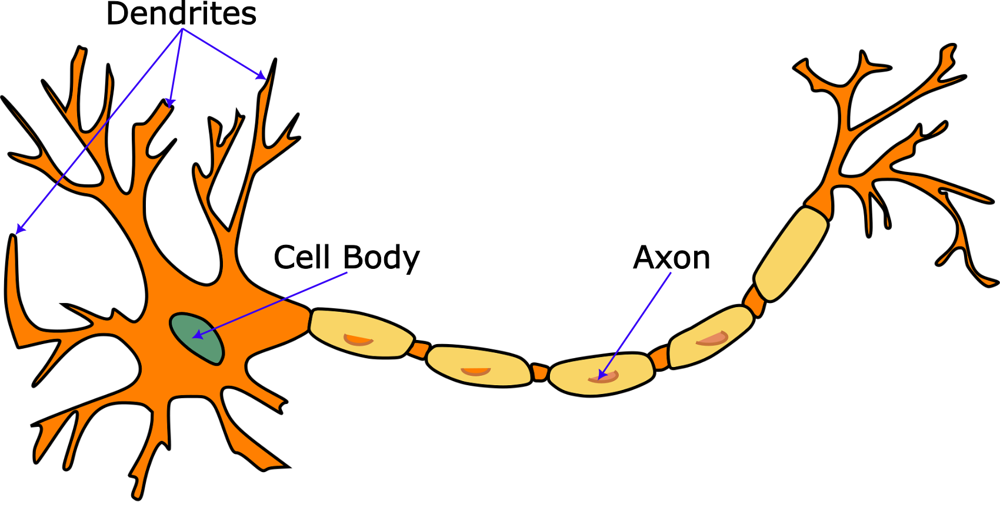{#fig-neuron}

The diagram below shows an (extremely) simplified model of a neuron which can have any number of real-valued inputs. Each input is multiplied by a number called a *weight*, and the results are then summed together, along with another number called a *bias*. Without the bias term, if all the inputs to the neuron were zero, their weighted sum would be zero no matter what. This would limit the neuron's ability to fit data. Lastly, the summed result is passed through an *activation function* to produce the final output.

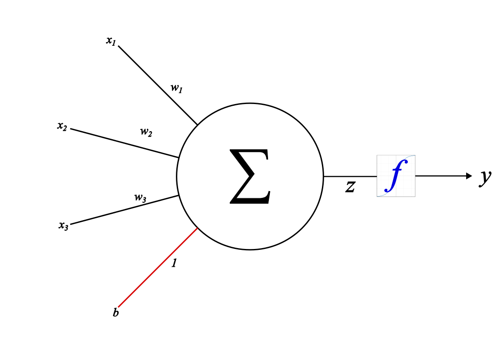{#fig-artificial-neuron}

Let us suppose the inputs are $x_1, x_2, \dots, x_n$, the corresponding weights are $w_1, w_2, \dots, w_n$, and the bias is $b$. The sum of the weighted inputs and the bias is then:

$$z = w_1x_1 + w_2x_2 + \dots + w_nx_n + b$$

or

$$z = \sum_i w_ix_i + b$$

The final output is the result of applying the activation function to this sum.

$$y = f(z)$$

If we collect the inputs and weights into vectors $\mathbf{x}$ and $\mathbf{w}$, we can restate the neuron's computations more compactly as:

$$
\begin{aligned}
z &= \mathbf{w} \cdot \mathbf{x} + b \\
y &= f(z)
\end{aligned}
$$

Maybe some of this looks familiar if you've read my previous posts. I'll let you in on a secret: everything we've covered in the series so far is actually a special case of an artificial neuron!

[Linear regression](https://medium.com/@pdasedano/linear-regression-from-scratch-2f25c1ab21ea) can be modeled by a neuron whose activation function is the identity $f(z) = z$. [Logistic regression](https://medium.com/@pdasedano/logistic-regression-from-scratch-e5b383e48f9e) can be modeled by a neuron whose activation function is the sigmoid function 

$$\sigma (z) = \frac{1}{1 + e^{-z}}$$

If just a single neuron can do all that, imagine what a network of them is capable of...

## Fully-Connected Layer

Imagine we have inputs $x_1, \dots, x_n$ and feed every input simultaneously into $m$ neurons. This is called a *fully-connected layer*.

We will denote the weights of the $i$th neuron by $w_{i1}, w_{i2}$, and so on, meaning the $j$th weight of the $i$th neuron is $w_{ij}$. The output of the $i$th neuron before the activation function is applied (aka the *unactivated output*) is

$$z_i = w_{i1}x_1 + w_{i2}x_2 + \dots + w_{in}x_n + b_i$$

Suppose every neuron has the same activation function $f$. The final output of the $i$th neuron is then

$$y_i = f(z_i)$$

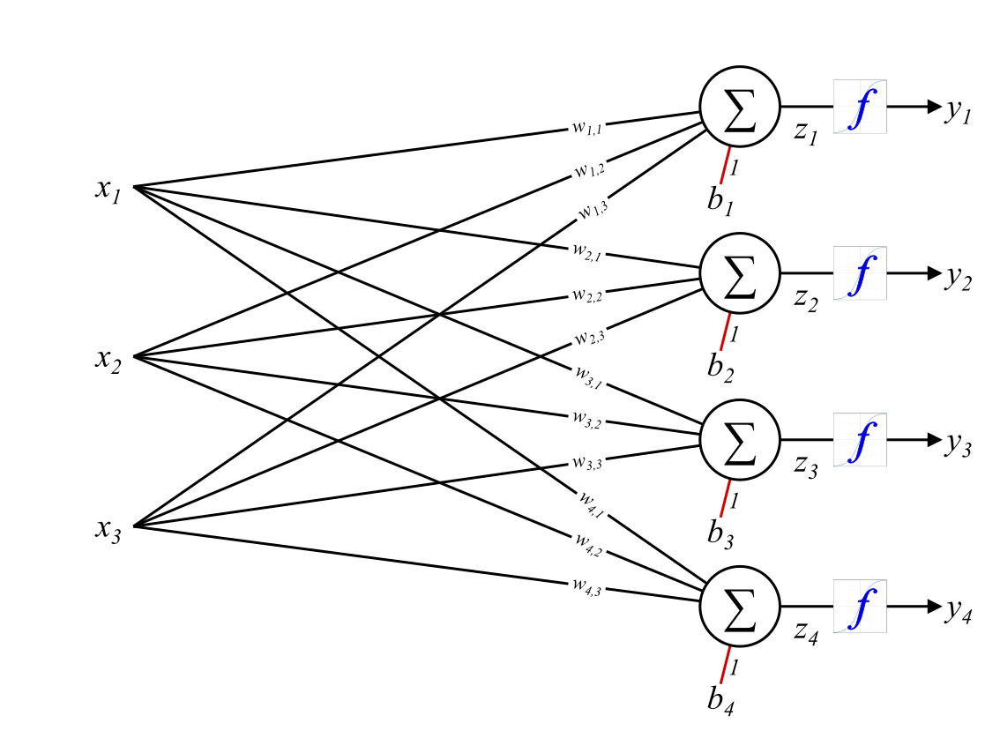{#fig-fc}

The inputs to a fully-connected layer could represent many things such as the pixels in an image or data about the passengers of the Titanic. As before, we can collect the inputs into a vector $\mathbf{x}$. Let's call an input vector a *sample*. If it is used to train the neural network, it's a *training sample*.

We could just feed samples into a layer one-by-one. However, there is a more efficient method called *batching*. We can arrange sample vectors so that each one is a column of a matrix.

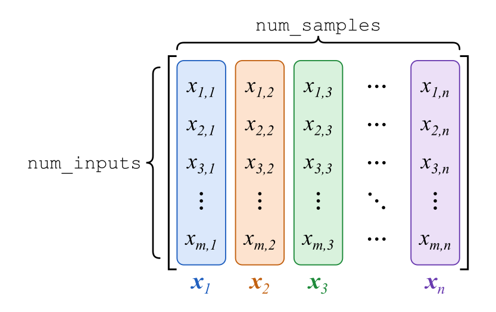{#fig-batch}

We create an input matrix $\mathbf{X}$, a batch of samples where each column is an input vector. In NumPy terms its shape would be `(num_inputs, num_samples)` where `num_inputs` is the length of each vector and `num_samples` is the number of samples in the batch.

In index form, $x_{ij}$ is the $i$th element of the $j$th sample. The unactivated output of the $i$th neuron for sample $j$ is

$$z_{ij} = w_{i1}x_{1j} + w_{i2}x_{2j} + \dots + w_{in}x_{nj} + b_i$$

or more compactly,

$$z_{ij} = \sum_k w_{ik}x_{kj} + b_i$$

and the corresponding final output is

$$y_{ij} = f(z_{ij})$$

In vectorized form, these equations can be written as:

$$\mathbf{Z} = \mathbf{W}\mathbf{X} + \mathbf{b}\mathbf{1}^T$$ {#eq-linear-matrix}

and

$$\mathbf{Y} = f(\mathbf{Z})$$ {#eq-activation-matrix}

In @eq-linear-matrix, $\mathbf{1}$ is a vector of 1s of length `num_samples`. The term $\mathbf{b}\mathbf{1}^T$ may look a bit confusing but all it does is create a matrix of biases where each column is identical, which is what we want since the same bias vector is used for every sample.

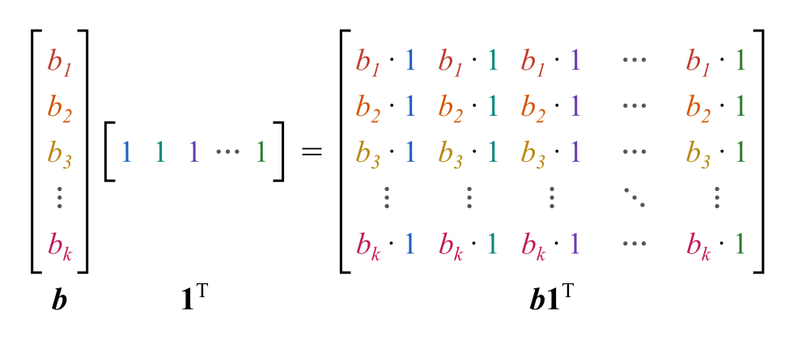{#fig-bias-broadcast}

@eq-linear-matrix and @eq-activation-matrix provide a very compact way of describing a fully-connected layer. Such layers will form the main building block of our neural network.

## Feedforward Neural Network

We are now ready to create a **feedforward neural network**. We do this by connecting multiple fully-connected layers in sequence, using the output of one layer as the input to the next. The number of neurons and activation function can vary between layers. The initial point where data is fed into the network is called the *input layer*. The final layer is called the *output layer*, and in between are *hidden layers*.

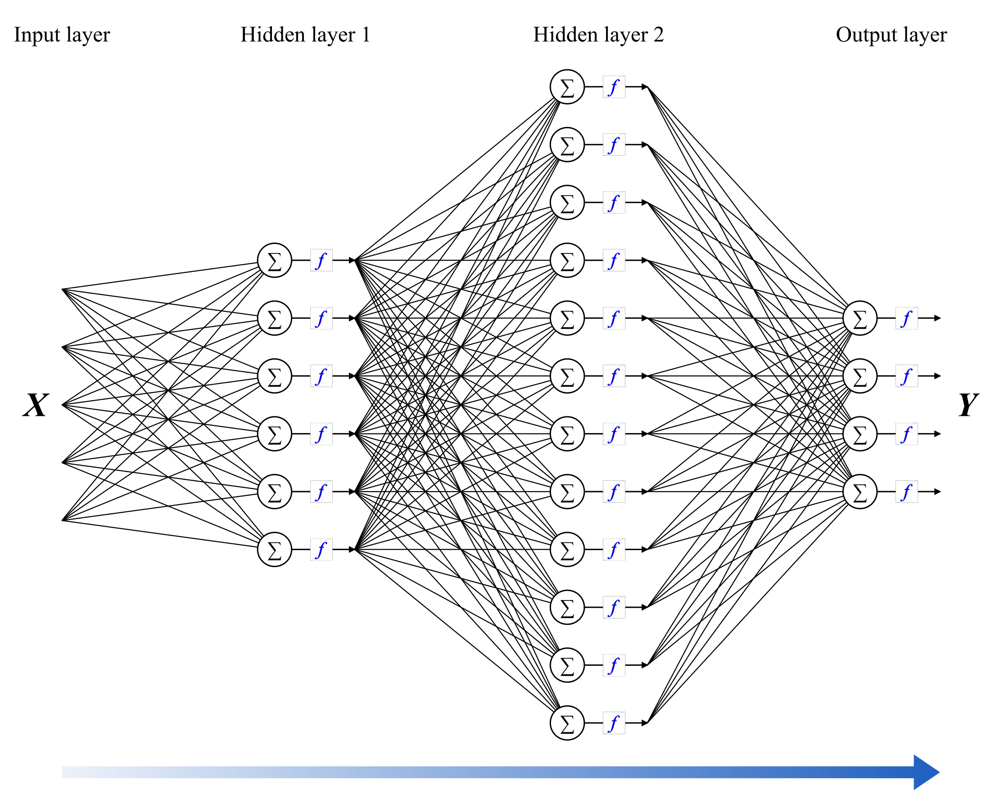{#fig-feedforward}

Let $\mathbf{X}$ be a batch of input data. Using superscripts to index which layer we are referring to, we can write the computation of a feedforward neural network as follows:


$$
\begin{aligned}
\mathbf{Y}^0 &= \mathbf{X} \\
\mathbf{Z}^1 &= \mathbf{W}^1\mathbf{Y}^0 + \mathbf{b}^1\mathbf{1}^T \\
\mathbf{Y}^1 &= f^1(\mathbf{Z}^1) \\
\mathbf{Z}^2 &= \mathbf{W}^2\mathbf{Y}^1 + \mathbf{b}^2\mathbf{1}^T \\
\mathbf{Y}^2 &= f^2(\mathbf{Z}^2) \\
&\vdots \\
\mathbf{Z}^L &= \mathbf{W}^L\mathbf{Y}^{L - 1} + \mathbf{b}^L\mathbf{1}^T \\
\mathbf{Y}^L &= f^L(\mathbf{Z}^L)
\end{aligned}
$$

where $L$ is the total number of layers.

More compactly,

$$
\begin{aligned}
\mathbf{Z}^i &= \mathbf{W}^i\mathbf{Y}^{i - 1} + \mathbf{b}^i\mathbf{1}^T \\
\mathbf{Y}^i &= f^i(\mathbf{Z}^i)
\end{aligned}
$$ {#eq-forward}

for $i = 1$ up to $i = L$.

In index form,

$$
\begin{aligned}
z^i_{jk} &= \sum_l w^i_{jl}y^{i - 1}_{lk} + b^i_j \\
y^i_{jk} &= f^i(z^i_{jk})
\end{aligned}
$$ {#eq-forward-index}

::: {.callout-note collapse="true"}
### Elementwise Assumption

The second line of @eq-forward-index only holds if the activation function is applied elementwise to each neuron’s output. This matches the earlier description of a fully-connected layer, but later we will encounter an activation function called softmax which works differently. Fortunately, it will only be used in the output layer so the formula still applies to the rest of the network.
:::

There is a mathematical result called the [Universal Approximation Theorem](https://en.wikipedia.org/wiki/Universal_approximation_theorem) which shows that a feedforward neural network having at least one hidden layer with a suitable activation function can approximate any continuous function. What this means is that in principle a neural network can model arbitrarily complex relationships between inputs and outputs. The question is how to obtain a network which models a phenomenon of interest. This is where the training process comes in.

## Backpropagation

In the post on logistic regression, we discussed gradient descent as a way to minimize a loss function expressing the error between predicted and target values. If you aren't clear on this, I would recommend taking a look at that post before reading further. We can use gradient descent to train a neural network, but we need to find the gradient of the loss function with respect to all the weights and biases in the network. This is done using a technique called *backpropagation*, which computes these gradients by applying the chain rule of calculus.

Backpropagation is probably *the* most important algorithm in modern machine learning. It is what allows neural networks to do everything from recognizing cat pictures to playing Go, predicting how proteins fold, and generating humanlike dialog. As with gradient descent, the basic idea behind it is surprisingly simple, though unfortunately the nitty-gritty math details are not.

A feedforward neural network applies a sequence of operations to input data to produce its output. We can plug this final output into a loss function like $\text{Loss}(\mathbf{Y}^L, \mathbf{T})$ where $\mathbf{T}$ is the target output. Assuming we know how to take the derivative of $\text{Loss}$, we can then compute its gradient w.r.t. $\mathbf{Y}^L$: $\nabla_{\mathbf{Y}^L} \text{Loss}(\mathbf{Y}^L, \mathbf{T})$. That's great and all, but we really need the gradients of $\text{Loss}$ with respect to the weights and biases in every layer of the neural network. After all, these are the tunable parameters of the network which must be updated for it to learn. How do we obtain these? Using the chain rule.

Consider that the output of a given layer, $\mathbf{Y}^i$, influences the loss only through the rest of the sequence of operations in the network. Let $\mathcal{L}^i$ represent the rest of the neural network after layer $i$, including the loss function. So

$$\text{Loss} = \mathcal{L}^i(\mathbf{Y}^i)$$

By @eq-forward,

$$\mathbf{Y}^i = f^i(\mathbf{Z}^i)$$

so

$$\text{Loss} = \mathcal{L}^i(f^i(\mathbf{Z}^i))$$

Now suppose we already know the gradient of loss w.r.t. the output of layer $i$. This is $\mathbf{\nabla}_{\mathbf{Y}^i} \text{Loss}$, or in index form, $\frac{\partial \text{Loss}}{\partial y^i_{jk}}$.

Via the multivariable chain rule,

$$\frac{\partial \text{Loss}}{\partial z^i_{jk}} = \sum_m \sum_n \frac{\partial \text{Loss}}{\partial y^i_{mn}} \frac{\partial y^i_{mn}}{\partial z^i_{jk}}$$

By @eq-forward-index, $y^i_{mn}$ only depends on $z^i_{jk}$ when $m = j$ and $n = k$. In all other cases, $\frac{\partial y^i_{mn}}{\partial z^i_{jk}} = 0$. Thus all but one term of the double sum vanishes and we are left with

$$\frac{\partial \text{Loss}}{\partial z^i_{jk}} = \frac{\partial \text{Loss}}{\partial y^i_{jk}} \frac{\partial y^i_{jk}}{\partial z^i_{jk}}$$ {#eq-dL-dz}

Now we can find the derivatives of the loss w.r.t. the weights and biases of the layer. Applying the multivariable chain rule to the first line of @eq-forward-index,

$$\frac{\partial \text{Loss}}{\partial w^i_{jk}} = \sum_m \sum_n \frac{\partial \text{Loss}}{\partial z^i_{mn}} \frac{\partial z^i_{mn}}{\partial w^i_{jk}}$$

Note that if $m \neq j$ then $z^i_{mn}$ does not depend on $w^i_{jk}$ and thus $\frac{\partial z^i_{mn}}{\partial w^i_{jk}} = 0$. Consequently, the expression reduces to

$$\frac{\partial \text{Loss}}{\partial w^i_{jk}} = \sum_n \frac{\partial \text{Loss}}{\partial z^i_{jn}} \frac{\partial z^i_{jn}}{\partial w^i_{jk}}$$ {#eq-dL-dw}

Similarly for the bias,

$$\frac{\partial \text{Loss}}{\partial b^i_j} = \sum_n \frac{\partial \text{Loss}}{\partial z^i_{jn}} \frac{\partial z^i_{jn}}{\partial b^i_j}$$ {#eq-dL-db}

Finally we can get the derivatives of loss w.r.t. the input to layer $i$, which is the output of layer $i - 1$, by once again making use of the chain rule and @eq-forward-index:

$$\frac{\partial \text{Loss}}{\partial y^{i - 1}_{jk}} = \sum_m \sum_n \frac{\partial \text{Loss}}{\partial z^i_{mn}} \frac{\partial z^i_{mn}}{\partial y^{i - 1}_{jk}}$$

Note that $y^{i - 1}_{jk}$ only occurs in the computation of $z^i_{mn}$ if $k = n$ (that is, if they belong to the same training sample). Thus the equation simplifies to

$$\frac{\partial \text{Loss}}{\partial y^{i - 1}_{jk}} = \sum_m \frac{\partial \text{Loss}}{\partial z^i_{mk}} \frac{\partial z^i_{mk}}{\partial y^{i - 1}_{jk}}$$ {#eq-dL-dy}

We have come full circle. If we know the gradient of the loss w.r.t. the output of layer $i$ we can not only obtain the gradients for that layer's weights and biases, but also the gradient w.r.t. the output of layer $i - 1$. This enables us to repeat the whole process for the previous layer, and the one before that, and so on, *propagating* the gradients *back* throughout the entire network.

In order to perform the calculations, we need the derivatives $\frac{\partial y^i_{jk}}{\partial z^i_{jk}}$, $\frac{\partial z^i_{jn}}{\partial w^i_{jk}}$, $\frac{\partial z^i_{jn}}{\partial b^i_j}$, and $\frac{\partial z^i_{mk}}{\partial y^{i - 1}_{jk}}$.

The first can easily be obtained from @eq-forward-index:

$$\frac{\partial y^i_{jk}}{\partial z^i_{jk}} = {f^i}'(z^i_{jk})$$ {#eq-dy-dz}

For the second, reindexing @eq-forward-index gives

$$z^i_{jn} = \sum_l w^i_{jl}y^{i - 1}_{ln} + b^i_j$$

Thus

$$\frac{\partial z^i_{jn}}{\partial w^i_{jk}} = y^{i - 1}_{kn}$$ {#eq-dz-dw}

And for the bias,

$$\frac{\partial z^i_{jn}}{\partial b^i_j} = 1$$ {#eq-dz-db}

Finally, reindexing @eq-forward-index again,

$$z^i_{mk} = \sum_l w^i_{ml}y^{i - 1}_{lk} + b^i_m$$

so

$$\frac{\partial z^i_{mk}}{\partial y^{i - 1}_{jk}} = w^i_{mj}$$ {#eq-dz-dy}

At this point we have everything required to perform backpropagation through a feedforward neural network. However, the index forms of these equations are neither the easiest to read nor the most efficient to implement in code. We can vectorize them to obtain more compact forms.

### Vectorized Backprop

By substituting @eq-dy-dz into @eq-dL-dz we obtain

$$\frac{\partial \text{Loss}}{\partial z^i_{jk}} = \frac{\partial \text{Loss}}{\partial y^i_{jk}} {f^i}'(z^i_{jk})$$

In matrix form this is

$$\mathbf{\nabla}_{\mathbf{Z}^i} \text{Loss} = \mathbf{\nabla}_{\mathbf{Y}^i} \text{Loss} \odot {f^i}'(\mathbf{Z}^i)$$ {#eq-bp-Z}

where $\odot$ is the Hadamard product.

Next, substituting @eq-dz-dw into @eq-dL-dw gives

$$
\begin{aligned}
\frac{\partial \text{Loss}}{\partial w^i_{jk}} &= \sum_n \frac{\partial \text{Loss}}{\partial z^i_{jn}} y^{i - 1}_{kn} \\
&= \sum_n \frac{\partial \text{Loss}}{\partial z^i_{jn}} (y^{i - 1})^T_{nk}
\end{aligned}
$$

Vectorized:

$$\mathbf{\nabla}_{\mathbf{W}^i} \text{Loss} = \mathbf{\nabla}_{\mathbf{Z}^i} \text{Loss} (\mathbf{Y}^{i - 1})^T$$ {#eq-bp-W}

Substituting @eq-dz-db into @eq-dL-db gives

$$\frac{\partial \text{Loss}}{\partial b^i_j} = \sum_n \frac{\partial \text{Loss}}{\partial z^i_{jn}}$$

Vectorized:

$$\mathbf{\nabla}_{\mathbf{b}^i} \text{Loss} = (\mathbf{\nabla}_{\mathbf{Z}^i} \text{Loss}) \mathbf{1}$$ {#eq-bp-b}

since matrix multiplication with a vector of 1s is equivalent to summing each row of the matrix.

Substituting @eq-dz-dy into @eq-dL-dy leads to

$$
\begin{aligned}
\frac{\partial \text{Loss}}{\partial y^{i - 1}_{jk}} &= \sum_m \frac{\partial \text{Loss}}{\partial z^i_{mk}} w^i_{mj} \\
&= \sum_m (w^i)^T_{jm} \frac{\partial \text{Loss}}{\partial z^i_{mk}}
\end{aligned}
$$

Vectorized:

$$\mathbf{\nabla}_{\mathbf{Y}^{i - 1}} \text{Loss} = (\mathbf{W}^i)^T \mathbf{\nabla}_{\mathbf{Z}^i} \text{Loss}$$ {#eq-bp-Y}

There we go! These four matrix equations allow backprop to be implemented more or less directly in NumPy using efficient linear algebra operations.

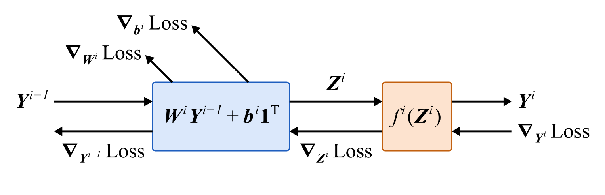{#fig-backprop}

## The MNIST Dataset

Now that we know how to train a neural network, let's take a look at the data we will train it on.

The dataset consists of grayscale images of handwritten digits, 28x28 pixels in size. Each image is flattened into a vector of 784 numbers in the range 0-255. The training data is provided as a CSV file, which we load into a pandas DataFrame with 785 columns. The first column, the label, indicates the correct digit for the image. The following columns contain the pixel values. The test data is stored similarly but omits the labels. Let's take a look.

```python
train_data = pd.read_csv('/kaggle/input/competitions/digit-recognizer/train.csv')
train_data.head()
```

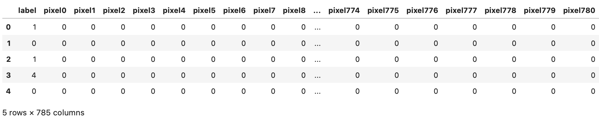{#fig-mnist-train-head}

```python
train_data.shape
```

`(42000, 785)`

```python
test_data = pd.read_csv('/kaggle/input/competitions/digit-recognizer/test.csv')
test_data.head()
```

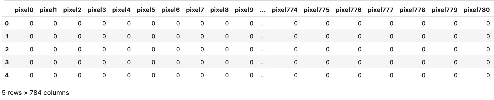{#fig-mnist-test-head}

```python
test_data.shape
```

`(28000, 784)`

## Architecture of the Network

With knowledge of the MNIST dataset, we can design a neural network for the digit classification task. I chose to create a network with one hidden layer. It takes 784 inputs since this is the number of pixels in each image. The hidden layer contains 4096 neurons, and its activation function is the [Rectified Linear Unit](https://en.wikipedia.org/wiki/Rectified_linear_unit) or ReLU function, defined by $f(z) = \max(0, z)$. Why this function in particular? A simple answer is that it's very cheap to compute, and has been shown to work well in practice. Another reason is that in order for the Universal Approximation Theorem to apply, the hidden layer must use a non-polynomial activation function and ReLU fits the bill.

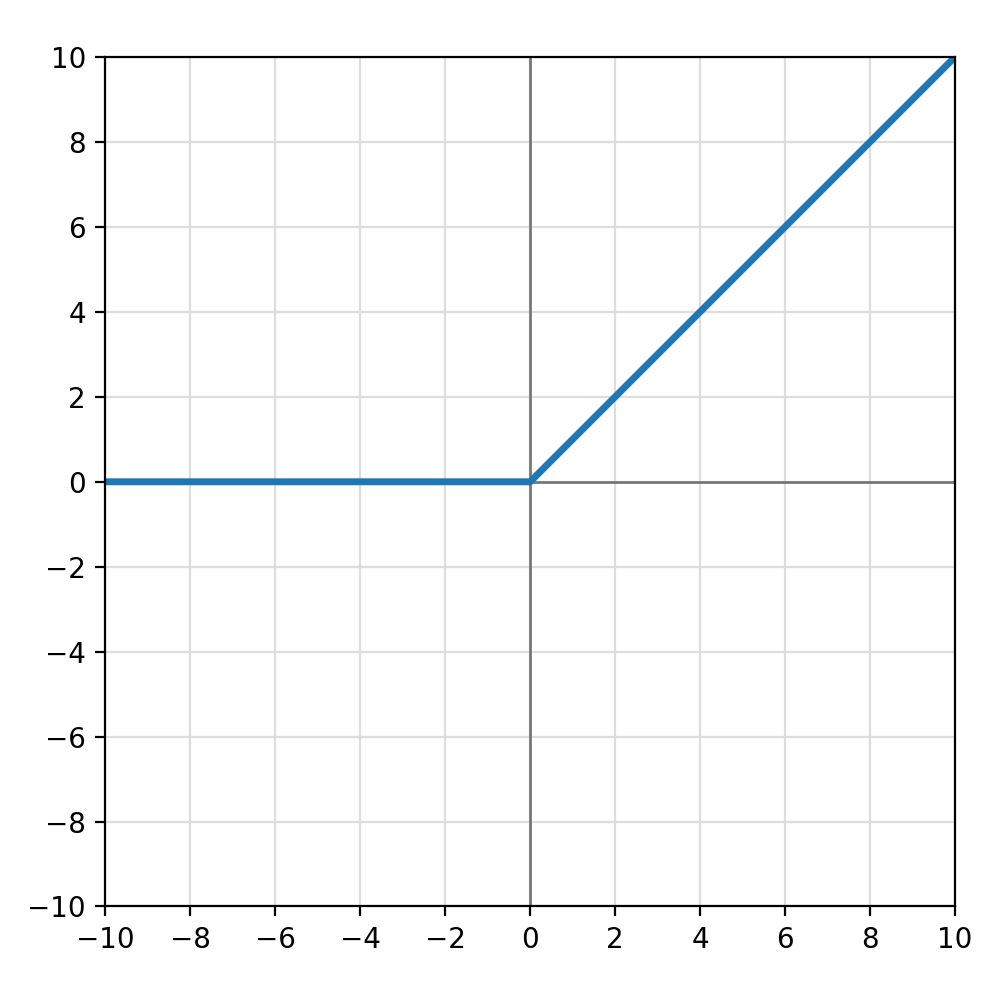{#fig-relu}

The network has 10 neurons in its output layer, one for each of the digits 0-9. It will be trained to output a probability distribution over digits: the output of the first neuron corresponds to digit 0, the output of the second to digit 1, and so on. The network's classification for an image will be the digit with the highest estimated probability.

In order for the outputs to form a valid probability distribution, each one must be nonnegative and the sum of all the outputs must equal 1. The output layer will use the [softmax](https://en.wikipedia.org/wiki/Softmax_function) activation function to ensure this.

We now need to define a loss function to see how well our network is performing. For this we will use something called cross-entropy loss. It provides an indication of how closely two probability distributions match. To calculate the loss for an individual training sample, we first pass it through the network and obtain the output $\mathbf{y}^L$ representing the predicted probability distribution. We need to compare it to a target (correct) probability distribution. What should this be? Easy: since we know with certainty the correct digit for each training sample, the target distribution should assign probability 1 to the correct digit and probability 0 to all other digits. This is called a *one-hot* representation. Each digit label in `train_data` will be converted to one-hot, as shown in the diagram below.

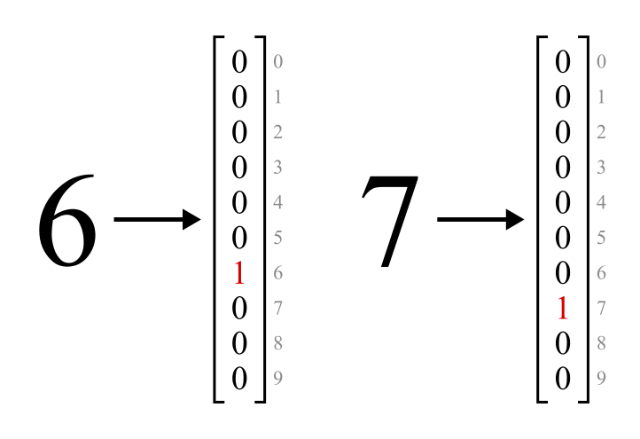{#fig-one-hot}

The following diagram summarizes the architecture of the neural network.

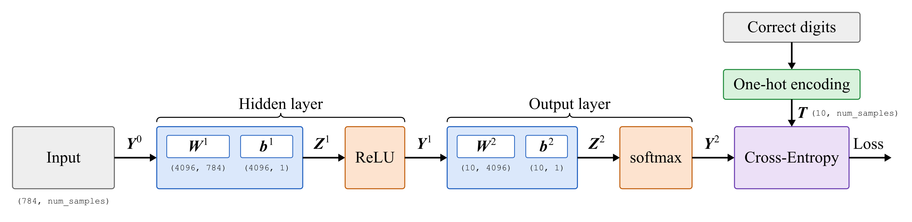{#fig-mnist-architecture}

The two parts which are still unexplained are the softmax function and cross-entropy loss. Let's take a look at them now.

## Softmax

In the post on logistic regression, we used the sigmoid function to map the real-valued output of a linear classifier to a probability. A single number was sufficient for binary classification, but now we need to map a vector of 10 real numbers in the range $(-\infty, \infty)$ into probabilities for each class. We want the relative sizes of the network's outputs to be preserved. That is, if the unactivated output for class $i$ is larger than that for class $j$, then the probability of class $i$ should be larger than that of class $j$.

How can we achieve these objectives? Let's work backwards starting from a vector of class probabilities $\mathbf{p} = [p_1, p_2, \dots, p_{n}]$ such that $\sum_{i=1}^{n} p_i = 1$. For any pair of probabilities $p_i$ and $p_j$, we can compute the odds $\frac{p_i}{p_j}$. We take the logarithm of this and obtain $\log \frac{p_i}{p_j} = \log p_i - \log p_j$.

Now we will define a vector $\mathbf{z} = [z_1, z_2, \dots, z_{n}]$ where for all $i, j \in \{1, 2, \dots, n\}$, 

$$z_i - z_j = \log p_i - \log p_j$$ {#eq-logit-odds-ratio}

The elements of this vector are called *logits* in reference to the term *log-odds*. 

Obviously such a vector can be obtained by setting $z_i = \log p_i$, but that is not the only possibility. For an arbitrary constant $C$, $z_i = \log p_i + C$ also satisfies @eq-logit-odds-ratio.

This allows us to go from a vector of class probabilities $\mathbf{p}$ to a vector of logits $\mathbf{z}$ whose elements can range from $-\infty$ to $\infty$. @eq-logit-odds-ratio implies that if $z_i > z_j$, then $p_i > p_j$ as we wanted. However, the choice of $\mathbf{z}$ is not unique since it depends on the arbitrary constant $C$.

Now imagine we are given only $\mathbf{z}$ without being told the value of $C$, and want to recover the probabilities. At first glance this might seem impossible. However, we can actually solve for $C$ using the fact that the probabilities must sum to 1. 

$$z_i = \log(p_i) + C$$

implies that

$$p_i = e^{z_i - C}$$

Thus

$$
\begin{aligned}
\sum_{i=1}^{n} e^{z_i - C} &= 1 \\
\frac{\sum_{i=1}^{n} e^{z_i}}{e^C} &= 1 \\
e^C &= \sum_{i=1}^{n} e^{z_i}
\end{aligned}
$$

Therefore,

$$p_i = e^{z_i - C} = \frac{e^{z_i}}{e^C}$$
$$p_i = \frac{e^{z_i}}{\sum_{j=1}^{n} e^{z_j}}$$ {#eq-softmax}

@eq-softmax can be used to convert any vector $\mathbf{z}$ of real numbers into a vector $\mathbf{p}$ of probabilities. The probabilities will satisfy @eq-logit-odds-ratio, which ensures that the larger the value of $z_i$ relative to the other logits, the larger the probability $p_i$ will be.

In fact, @eq-softmax is the definition of the softmax function:

$$\text{softmax}(\mathbf{z})_i = \frac{e^{z_i}}{\sum_{j=1}^{n} e^{z_j}}$$

### Batched Softmax

So far we have discussed softmax applied to single vectors. However, it can be extended in a straightforward way to handle a batch of logit vectors.

For a batch $\mathbf{Z}$ of shape `(num_classes, num_samples)`, we just need to compute softmax over every column (sample vector) separately. Different columns have no bearing on each other. Thus the formula becomes

$$\text{softmax}(\mathbf{Z})_{ij} = \frac{e^{z_{ij}}}{\sum_{k=1}^{n} e^{z_{kj}}}$$ {#eq-softmax-batch}

## Cross-Entropy Loss

Now we can move on to explaining the loss function. Let the network's output for a single training sample be $\mathbf{y}^L$ (a probability distribution over digits) and the target be $\mathbf{t}$ (the target distribution, in this case a one-hot vector). The cross-entropy loss for that sample is given by

$$\text{Loss}(\mathbf{y}^L, \mathbf{t}) = -\sum_i t_i \log y^L_i$$

For a batch, we simply take the average over the training samples:

$$\text{Loss}(\mathbf{Y}^L, \mathbf{T}) = - \frac{1}{N} \sum_j\sum_i t_{ij} \log y^L_{ij}$$ {#eq-ce-batch}

where $N$ is the number of samples in the batch.

### Surprise!

If you are not already familiar with the concepts, this formula probably doesn't mean much. I said earlier that it relates to the similarity between two probability distributions. Now I want to provide some motivation for the formula and share an interesting perspective in the process.

In probability and information theory, there is a quantity called *surprise*, which is defined as the negative log of probability, $-\log p$. This formula matches up with our intuition in an important way. Generally speaking, an event is more surprising if it has a lower probability of occurring. For example, it would not be surprising to flip a fair coin and have it land on tails, but to do so ten times and have it come up tails every time would be very surprising. The quantity $-\log p$ behaves analogously since it grows as $p$ shrinks. For $p = 1$, $-\log p = 0$, and as $p \rightarrow 0$, $-\log p \rightarrow \infty$. 

Surprise also has a fascinating and *surprising* relationship to information. Imagine generating a length-$k$ string of random bits. The probability of getting any specific bitstring is $2^{-k}$. The surprise associated with that bitstring is then $-\log 2^{-k}$, which equals $k$ if we use a base-2 logarithm. Thus, surprise can be interpreted as a measurement of the number of bits of information received from an observation.

The *entropy* of a probability distribution $p$ over some set of observations represented by a random variable $X$ can be defined as the expected surprise for a sample drawn according to that distribution:

$$H(X) = \mathbb{E}(-\log p(X)) = -\sum_{x \in X} p(x) \log p(x)$$

This means entropy can also be interpreted as the amount of information you would expect to gain from observing said sample.

*Cross-entropy* is defined as the expected surprise when an observation is drawn from one probability distribution $p$, but surprise is calculated using a *different* probability distribution $q$:

$$H(p, q) = \mathbb{E}_p(-\log q(X)) = -\sum_{x \in X} p(x) \log q(x)$$

In the context of machine learning, $x$ is the data, $p$ is the true (target) probability distribution over the data (e.g. $t_{ij}$), and $q$ is the model's estimated probability distribution (e.g. $y^L_{ij}$). Cross-entropy thus quantifies the expected surprise of the model according to its own distribution $q(x)$ for a sample drawn from the true distribution $p(x)$.

The more accurately the model can predict the data, i.e. the more similar $q(x)$ is to $p(x)$, the less surprising it will find the observed data and the lower cross-entropy will be. Another interpretation is that the more knowledge the model already possesses, the less new information it will gain from observing the data.

Hopefully this digression provided some insight into why minimizing cross-entropy is a useful objective in machine learning. Now we can move on to obtaining the gradient of the loss function.

## Computing Gradients for Backprop

In order to get started with backpropagation, we need the gradient of the loss w.r.t. the output of the neural network. Rather than using the softmax output $\mathbf{Y}^L$, it will be more convenient to consider the gradient of the loss w.r.t. the unactivated output $\mathbf{Z}^L$. This has a particularly simple form, as we will see.

### Derivatives of Loss w.r.t. $\mathbf{Y}^L$

By @eq-ce-batch,

$$\frac{\partial \text{Loss}}{\partial y^L_{ij}} = \frac{\partial}{\partial y^L_{ij}}(-\frac{1}{N} \sum_m\sum_n t_{mn} \log y^L_{mn}) = -\frac{1}{N} \sum_m\sum_n t_{mn} \frac{\partial \log y^L_{mn}}{\partial y^L_{ij}}$$

Note that $\frac{\partial \log y^L_{mn}}{\partial y^L_{ij}} = \frac{1}{y^L_{ij}}$ if $m = i$ and $n = j$. Otherwise it is 0. Thus all but one of the summation terms vanish and we are left with

$$\frac{\partial \text{Loss}}{\partial y^L_{ij}} = -\frac{1}{N} \frac{t_{ij}}{y^L_{ij}}$$ {#eq-dL-dyL}

### Softmax Derivatives

We also need the partial derivatives of the softmax activation function.

Recall @eq-softmax-batch. Since $\mathbf{Y}^L = \text{softmax}(\mathbf{Z}^L)$,

$$y^L_{ij} = \frac{e^{z^L_{ij}}}{\sum_k e^{z^L_{kj}}}$$ {#eq-softmax-yL}

Note that

$$\frac{\partial e^{z^L_{ij}}}{\partial z^L_{mj}} = \delta_{im}e^{z^L_{ij}}$$

since if $i = m$ the derivative is equal to $e^{z^L_{ij}}$, and it's 0 otherwise.

Thus

$$
\begin{aligned}
\frac{\partial y^L_{ij}}{\partial z^L_{mj}} &= \frac{\partial}{\partial z^L_{mj}} \frac{e^{z^L_{ij}}}{\sum_k e^{z^L_{kj}}}
\\
&= \frac{\partial e^{z^L_{ij}}}{\partial z^L_{mj}}\frac{1}{\sum_k e^{z^L_{kj}}} + e^{z^L_{ij}} \frac{\partial}{\partial z^L_{mj}}\frac{1}{\sum_k e^{z^L_{kj}}}
\\
&= \delta_{im}e^{z^L_{ij}}\frac{1}{\sum_k e^{z^L_{kj}}} + e^{z^L_{ij}}\left(-\frac{1}{(\sum_k e^{z^L_{kj}})^2}e^{z^L_{mj}}\right)
\\
&= \delta_{im}\frac{e^{z^L_{ij}}}{\sum_k e^{z^L_{kj}}} - \frac{e^{z^L_{ij}} e^{z^L_{mj}}}{\left(\sum_k e^{z^L_{kj}}\right)^2}
\\
&= \delta_{im}\,\text{softmax}(\mathbf{Z}^L)_{ij} - \text{softmax}(\mathbf{Z}^L)_{ij}\,\text{softmax}(\mathbf{Z}^L)_{mj}
\\
&= \delta_{im}y^L_{ij} - y^L_{ij}y^L_{mj}
\\
&= y^L_{ij}(\delta_{im} - y^L_{mj})
\end{aligned}
$$

### Final Loss Gradient

Now we can compute the gradient of the loss w.r.t. the logits via the multivariable chain rule.

$$\frac{\partial \text{Loss}}{\partial z^L_{ij}} = \sum_m\sum_n \frac{\partial \text{Loss}}{\partial y^L_{mn}} \frac{\partial y^L_{mn}}{\partial z^L_{ij}}$$

By @eq-softmax-yL, $\frac{\partial y^L_{mn}}{\partial z^L_{ij}}$ vanishes unless $n = j$, so the above reduces to

$$\frac{\partial \text{Loss}}{\partial z^L_{ij}} = \sum_m \frac{\partial \text{Loss}}{\partial y^L_{mj}} \frac{\partial y^L_{mj}}{\partial z^L_{ij}}$$

By @eq-dL-dyL,

$$\frac{\partial \text{Loss}}{\partial y^L_{mj}} = -\frac{1}{N} \frac{t_{mj}}{y^L_{mj}}$$

so

$$
\begin{aligned}
\frac{\partial \text{Loss}}{\partial z^L_{ij}} &= -\frac{1}{N} \sum_m \frac{t_{mj}}{y^L_{mj}} \frac{\partial y^L_{mj}}{\partial z^L_{ij}}
\\
&= -\frac{1}{N} \sum_m \frac{t_{mj}}{y^L_{mj}} y^L_{mj}(\delta_{im} - y^L_{ij})
\\
&= -\frac{1}{N} \sum_m t_{mj}(\delta_{im} - y^L_{ij})
\\
&= \frac{1}{N} \sum_m t_{mj}(y^L_{ij} - \delta_{im}) 
\\
&= \frac{1}{N} \left( \sum_m t_{mj} y^L_{ij} - \sum_m t_{mj} \delta_{im} \right)
\end{aligned}
$$

Via $\sum_j \delta_{ij} x_{j} = x_i$ this becomes

$$\frac{\partial \text{Loss}}{\partial z^L_{ij}} = \frac{1}{N}\left( y^L_{ij} \sum_m t_{mj} - t_{ij} \right)$$

Since each column of $\mathbf{T}$ is a one-hot vector, $\sum_m t_{mj} = 1$. Thus the above reduces to

$$\frac{\partial \text{Loss}}{\partial z^L_{ij}} = \frac{1}{N} (y^L_{ij} - t_{ij})$$

In vectorized form, the gradient of the loss w.r.t. the logits is

$$\nabla_{\mathbf{Z}^L} \text{Loss} = \frac{1}{N} (\mathbf{Y}^L - \mathbf{T})$$ {#eq-ce-grad}

An incredibly simple result! It's just the difference between the predicted probabilities and the target probabilities divided by the number of samples.

### ReLU Derivative

The last piece we need for backprop is the derivative of the ReLU activation function which is used in the hidden layer. For this we will use

$$
\text{ReLU}'(z) = 
\begin{cases}
0 & z \le 0 \\
1 & z > 0
\end{cases}
$$ {#eq-relu-deriv}

Observant readers may notice that the derivative of ReLU is actually undefined at $z = 0$ since there is a sharp "corner" in the graph where the slope abruptly transitions from 0 to 1. However, in practice the derivative is set to 0 at this location as above.

## Implementation

At last we have all the ingredients, and it's time to code the neural network.

It will use a modular design informed by @fig-mnist-architecture. We will need several different types of layers. 

The first type will compute the unactivated output of a fully-connected layer, i.e. @eq-linear-matrix. This corresponds to the blue rectangles in @fig-mnist-architecture. It will be called `Linear` because it implements a linear function of the input, and also to follow [PyTorch's naming convention](https://docs.pytorch.org/docs/stable/generated/torch.nn.Linear).

```python
rng = np.random.default_rng()


class Linear:
    """
    A neural network layer which computes a linear function of the input using weights 
    and biases that are trainable by backpropagation with gradient descent.

    Parameters
    ----------
    n_inputs : int
        Number of inputs to the layer.
    n_outputs : int
        Number of outputs from the layer.
    """

    def __init__(self, n_inputs, n_outputs):
        # Weights are Kaiming initialized, drawn from a normal distribution with mean 0 and
        # variance 2 / n_inputs.
        self.weights = rng.normal(0, np.sqrt(2 / n_inputs), (n_outputs, n_inputs))
        self.bias = np.zeros((n_outputs, 1))
        self._last_input = None
```

As you can see, a `Linear` layer is defined by the number of inputs and number of outputs. It then creates a weight matrix and bias vector with the corresponding shapes. The weights are initialized using a method called [Kaiming initialization](https://en.wikipedia.org/wiki/Weight_initialization#He_initialization) which has been shown to improve the performance of neural networks using the ReLU activation function.

The class has a `forward` method which performs the computation of @eq-linear-matrix.

```python
    def forward(self, x):
        """
        Computes the output and saves the input for a future backward() call.
        
        Parameters
        ----------
        x : ndarray
            Input array.

        Returns
        -------
        ndarray
            Output array.
        """
        self._last_input = x
        
        return self.weights @ x + self.bias
```

Note that [NumPy's array broadcasting rules](https://numpy.org/doc/stable/user/basics.broadcasting.html) render the multiplication of the bias by $\mathbf{1}^T$ unnecessary as long as the bias has shape `(n_outputs, 1)`.

The class also has a `backward` method which takes a gradient as input. Using this and `self._last_input` stored from the most recent `forward` call, it computes `grad_wrt_weights`, `grad_wrt_bias`, and `grad_wrt_input` via @eq-bp-W, @eq-bp-b, and @eq-bp-Y respectively. It then performs a step of gradient descent by subtracting `grad_wrt_weights` and `grad_wrt_bias` from the weights and biases, nudging them in a direction that reduces loss for the training batch.

```python
    def backward(self, gradient):
        """
        Updates weights and biases via gradient descent and returns a gradient for
        backpropagation to a previous layer.

        Parameters
        ----------
        gradient : ndarray of float
            Gradient of loss w.r.t. the output of this layer.

        Returns
        -------
        ndarray of float
            Gradient of loss w.r.t. the input to this layer.
        """
        if self._last_input is None:
            raise RuntimeError("forward(input) must be called before backward(gradient)")

        grad_wrt_weights = gradient @ self._last_input.T
        grad_wrt_bias = np.sum(gradient, axis=1, keepdims=True)
        grad_wrt_input = self.weights.T @ gradient
        
        self.weights -= grad_wrt_weights
        self.bias -= grad_wrt_bias
        
        return grad_wrt_input
```

Note that `np.sum(gradient, axis=1, keepdims=True)` produces an equivalent result to @eq-bp-b. Due to `keepdims=True`, the shape of `grad_wrt_bias` is `(n_outputs, 1)` rather than just `(n_outputs,)`. This means `grad_wrt_bias` has the same shape as `self.bias`, which is necessary for `self.bias -= grad_wrt_bias` to work as intended.

Next we will create a ReLU layer, which computes @eq-activation-matrix.

```python
class ReLU:
    """
    A neural network layer which applies the ReLU activation function to its input.
    """
    
    def __init__(self):
        self._last_input = None

    def forward(self, x):
        """
        Computes the output and saves its input for a future backward() call.

        Parameters
        ----------
        x : ndarray
            Input array.

        Returns
        -------
        ndarray
            Result of applying ReLU to each element of the input array.
        """
        self._last_input = x
        
        return np.maximum(0, x)

    def backward(self, gradient):
        """
        Computes the gradient of loss w.r.t. this layer's input.

        Parameters
        ----------
        gradient : ndarray of float
            Gradient of loss w.r.t. the output of this layer.

        Returns
        -------
        ndarray of float
            Gradient of loss w.r.t. the input to this layer.
        """
        if self._last_input is None:
            raise RuntimeError("forward(input) must be called before backward(gradient)")

        relu_deriv = (self._last_input > 0).astype(float)
        
        return gradient * relu_deriv
```

Like the `Linear` layer, it has `forward` and `backward` methods, and stores the input to `forward` for later use in `backward`. `backward` uses @eq-bp-Z and @eq-relu-deriv to compute the backpropagated gradient.

Together, `Linear` and `ReLU` can be combined to form a fully-connected layer. You may be wondering why I didn't just combine them into a single class. This was my original design, but splitting them up has several advantages. It simplifies the gradient computations in each class, and enables a `Linear` layer to easily be coupled with different activation functions. It is also the method used by PyTorch.

Next we implement the softmax function:

```python
def softmax(logits, axis=0):
    """
    Parameters
    ----------
    logits : ndarray of float
        Array of logits.
    axis : int
        The axis over which to apply softmax.

    Returns
    -------
    ndarray of float
        An array of probabilities, the result of applying softmax to the logits over the
        specified axis.
    """
    shifted = logits - np.max(logits, axis=axis, keepdims=True)
    exp = np.exp(shifted)
    
    return exp / np.sum(exp, axis=axis, keepdims=True)
```

Subtracting the maximum logit from all the logits with `shifted = logits - np.max(logits, axis=axis, keepdims=True)` does not alter the resulting probabilities, and ensures that the largest value in the array is 0. This prevents numerical overflow caused by exponentiating a large number.

Next we can implement cross-entropy loss.

```python
class CELoss:
    """
    Cross-entropy loss on softmax(logits), averaged over samples.
    """

    def __init__(self):
        self._last_target = None
        self._last_probs = None
```

Its `forward` method takes in raw logits and the target output, computes probabilities from the logits using `softmax`, and then computes the loss via @eq-ce-batch.

```python
    def forward(self, logits, target):
        """
        Computes the cross-entropy loss for the given logits and targets. Saves targets and
        probabilities for a future backward() call.

        Parameters
        ----------
        logits : ndarray of float of shape (num_classes, num_samples)
            Array of logits representing a probability distribution over classes for each
            sample.
        target : ndarray of shape (num_classes, num_samples)
            The correct probability distributions over the classes, often one-hot
            (probability 1 for the correct class and 0 for the incorrect classes).

        Returns
        -------
        float
            The cross-entropy loss averaged over the samples.
        """
        probs = softmax(logits)

        self._last_target = target
        self._last_probs = probs

        num_samples = logits.shape[1]
        loss = -np.sum(target * np.log(probs)) / num_samples
        
        return loss
```

The `backward` method uses @eq-ce-grad to get the gradient of the loss w.r.t. the logits.

```python
    def backward(self):
        """
        Computes the gradient of the loss w.r.t. the logits from the most recent forward()
        call.
        
        Returns
        -------
        ndarray of float of shape (num_classes, num_samples)
            Gradient of loss w.r.t. the logits.
        """
        if self._last_probs is None:
            raise RuntimeError(
                "forward(logits, target) must be called before backward()"
            )
            
        num_samples = self._last_probs.shape[1]
        
        return (self._last_probs - self._last_target) / num_samples
```

Now we can create a class to represent a feedforward neural network. I have tried to make it maximally flexible, allowing it to contain any number of layers of any type as long as they have `forward` and `backward` methods.

```python
class FeedforwardNN:
    """
    A feedforward neural network with customizable layers, loss function and learning rate.

    Parameters
    ----------
    layers : list of object
        A list of layers in the neural network. Each layer should have a forward method
        which computes its output and a backward method which computes gradients for
        backpropagation and updates the layer's parameters by gradient descent if
        applicable.
    loss : object
        The loss to use for the neural network. Requires a backward method to compute the
        gradient of loss w.r.t. the output of the neural network.
    learning_rate : float
        Parameter controlling how large an update is made to the network's parameters
        during each step of gradient descent.
    """
    
    def __init__(self, layers, loss, learning_rate):
        self.layers = layers
        self._loss = loss
        self.learning_rate = learning_rate
        self._output = None

    def forward(self, x):
        """
        Passes input through all the layers of the network, computing the final output.
        Saves the output for a future loss() call.

        Parameters
        ----------
        x : ndarray
            Array of input to the network.

        Returns
        -------
        ndarray
            The output of the network for the given input.
        """
        self._output = x
        
        for layer in self.layers:
            self._output = layer.forward(self._output)
        
        return self._output

    def loss(self, target):
        """
        Computes the loss from the last forward() call.

        Parameters
        ----------
        target : ndarray
            The correct outputs which the network should have returned.

        Returns
        -------
        float
            Loss for the most recent forward() call.
        """
        if self._output is None:
            raise RuntimeError("forward(input) must be called before loss(target)")
            
        return self._loss.forward(self._output, target)

    def backward(self):
        """
        Performs backpropagation with gradient descent to train the neural network.
        Will only work if forward() and loss() have already been called.
        """
        gradient = self.learning_rate * self._loss.backward()

        for layer in reversed(self.layers):
            gradient = layer.backward(gradient)
```

Note that the `backward` method scales the gradient by `self.learning_rate` before passing it back through the layers. This allows the learning rate to control the size of the gradient descent steps each `Linear` layer takes. A more advanced implementation could enable per-layer tuning of the learning rate.

## Training the Neural Network

Let's write a function that evaluates a network's performance on a set of samples and targets.

```python
def evaluate(model, X, Y):
    """
    Gets mean loss and accuracy over (X, Y), without updating the model.

    Parameters
    ----------
    model : FeedforwardNN
        The neural network.
    X : ndarray of float of shape (num_samples, num_inputs)
        The array of inputs to be used for the evaluation.
    Y : ndarray of shape (num_samples, num_classes)
        The array of targets (correct classes) for the corresponding inputs.

    Returns
    -------
    tuple
        The model's average loss and proportion of correct answers.
    """
    num_samples = X.shape[0]

    # transpose to comply with input format expected by the model.
    X = X.T # (num_samples, num_inputs) -> (num_inputs, num_samples)
    Y = Y.T # (num_samples, num_classes) -> (num_classes, num_samples)
    
    logits = model.forward(X)
    loss = model.loss(Y)
    num_correct = np.sum(np.argmax(logits, axis=0) == np.argmax(Y, axis=0))

    return loss, num_correct / num_samples
```

Next we can write the core training loop.

```python
def train(model, X, Y, epochs, batch_size, X_eval, Y_eval):
    """
    Trains a neural network on the given inputs and targets for a certain number of epochs.
    Reports training and evaluation data for the training run.   

    Parameters
    ----------
    model : FeedforwardNN
        The neural network to be trained.
    X : ndarray of float of shape (num_samples, num_inputs)
        The array of inputs to be used for training.
    Y : ndarray of shape (num_samples, num_classes)
        The array of targets (correct classes) for the corresponding inputs.
    epochs : int
        Number of training epochs.
    batch_size : int
        How many inputs to feed the network at once during training.
    X_eval : ndarray of float of shape (num_samples, num_inputs)
        An array of inputs to be used for evaluation, separate from the training set.
    Y_eval : ndarray of shape (num_samples, num_classes)
        The array of targets for the corresponding evaluation inputs.

    Returns
    -------
    dict
        A history dict of per-epoch metrics. Epoch 0 performance is measured before
        training. After that, training metrics are averaged over each epoch's batches as
        the weights update, while eval metrics are measured once the epoch has finished.
    """
    num_samples = X.shape[0]
    history = {"train_loss": [], "train_acc": [], "eval_loss": [], "eval_acc": []}

    def record(epoch, train_loss, train_acc):
        history["train_loss"].append(train_loss)
        history["train_acc"].append(train_acc)
        message = f"epoch {epoch}: train_loss={train_loss:.4f} train_acc={train_acc:.4f}"

        eval_loss, eval_acc = evaluate(model, X_eval, Y_eval)
        history["eval_loss"].append(eval_loss)
        history["eval_acc"].append(eval_acc)
        message += f" eval_loss={eval_loss:.4f} eval_acc={eval_acc:.4f}"

        print(message)

    record(0, *evaluate(model, X, Y))
    
    for epoch in range(1, epochs + 1):
        perm = rng.permutation(num_samples)
        X, Y = X[perm], Y[perm]

        total_loss = 0.0
        num_correct = 0
        
        for start in range(0, num_samples, batch_size):
            # transpose to comply with input format expected by the model.
            batch_X = X[start:start + batch_size].T
            batch_Y = Y[start:start + batch_size].T

            logits = model.forward(batch_X)
            total_loss += model.loss(batch_Y) * batch_X.shape[1]
            num_correct += np.sum(
                np.argmax(logits, axis=0) == np.argmax(batch_Y, axis=0)
            )
            model.backward()

        record(epoch, total_loss / num_samples, num_correct / num_samples)

    return history
```

The model is trained on training samples `X` and targets `Y`, and evaluated on `X_eval` and `Y_eval`. Evaluating on separate data is important because it checks whether the model is [overfitting](https://en.wikipedia.org/wiki/Overfitting) to training data.

The helper function `record` appends training loss and accuracy to the `history` dict and then runs `evaluate` on the model. Before any training has occurred the model's performance is assessed with `record(0, *evaluate(model, X, Y))`. Then the main training loop runs: for each training epoch, `X, Y = X[perm], Y[perm]` shuffles the training data and targets. We step through the shuffled data in chunks of size `batch_size` (the last chunk will be shorter if the data length is not divisible by `batch_size`), run the model on each batch, compute the loss and accuracy, and train the model via `model.backward()`. At the end of each epoch, we call `record`, passing it the training loss and accuracy for that epoch.

We can now preprocess the data, define the model, and train it!

```python
EPOCHS = 30

if __name__ == '__main__':
    # divide by 255 to normalize pixel values
    # makes training more numerically well-behaved
    X = train_data.drop('label', axis=1).values / 255.0
    labels = train_data['label'].values
    Y = np.eye(10)[labels] # convert labels to one-hot representation
    
    # Hold out 10% of the labelled data for evaluation
    perm = rng.permutation(X.shape[0])
    num_eval = X.shape[0] // 10
    X_eval, Y_eval = X[perm[:num_eval]], Y[perm[:num_eval]]
    X_train, Y_train = X[perm[num_eval:]], Y[perm[num_eval:]]
    
    model = FeedforwardNN(
        layers=[Linear(784, 4096), ReLU(), Linear(4096, 10)],
        loss=CELoss(),
        learning_rate=0.01,
    )
    
    history = train(
        model,
        X_train,
        Y_train,
        epochs=EPOCHS,
        batch_size=64,
        X_eval=X_eval,
        Y_eval=Y_eval
    )
```

The line `Y = np.eye(10)[labels]` deserves some extra explanation. `np.eye(10)` creates a 10x10 identity matrix. Then `np.eye(10)[labels]` takes the `labels` (a vector of digits), and uses each digit as an index for this identity matrix. The result is a new matrix whose rows are one-hot vectors for each digit, since the $i$th row of the identity matrix has a 1 in the $i$th position and zeros in all other positions.

A `FeedforwardNN` is created based on @fig-mnist-architecture. One difference you may notice is that the network's output is the logits and the final `softmax` step occurs only within `CELoss`. This is fine for classification since the largest logit will correspond to the largest probability, so the predicted class is just the argmax of the logits. Hence the use of `np.argmax` in the `evaluate` and `train` functions.

Finally, the model is trained for 30 epochs with a batch size of 64.

## Kaggle Submission

Below is the code used to submit the model's predictions for the Digit Recognizer competition.

```python
X_test = test_data.values / 255.0
# Transpose X_test to comply with model input shape.
predictions = model.forward(X_test.T).argmax(axis=0)
submission = pd.DataFrame({
    'ImageId': np.arange(1, len(predictions) + 1),
    'Label': predictions,
})
submission.to_csv('submission.csv', index=False)
```

Now let's look at how well the network completes the task of classifying handwritten digits.

## Results

Below is a summary of the model's training and evaluation performance at intervals of 5 epochs.

```
epoch 0: train_loss=2.3755 train_acc=0.1045 eval_loss=2.3752 eval_acc=0.1029
epoch 5: train_loss=0.2543 train_acc=0.9306 eval_loss=0.2575 eval_acc=0.9274
epoch 10: train_loss=0.1968 train_acc=0.9470 eval_loss=0.2131 eval_acc=0.9374
epoch 15: train_loss=0.1636 train_acc=0.9560 eval_loss=0.1847 eval_acc=0.9457
epoch 20: train_loss=0.1397 train_acc=0.9639 eval_loss=0.1659 eval_acc=0.9502
epoch 25: train_loss=0.1213 train_acc=0.9699 eval_loss=0.1519 eval_acc=0.9538
epoch 30: train_loss=0.1066 train_acc=0.9737 eval_loss=0.1425 eval_acc=0.9579
```

Here are graphs of accuracy and loss for the same training run.

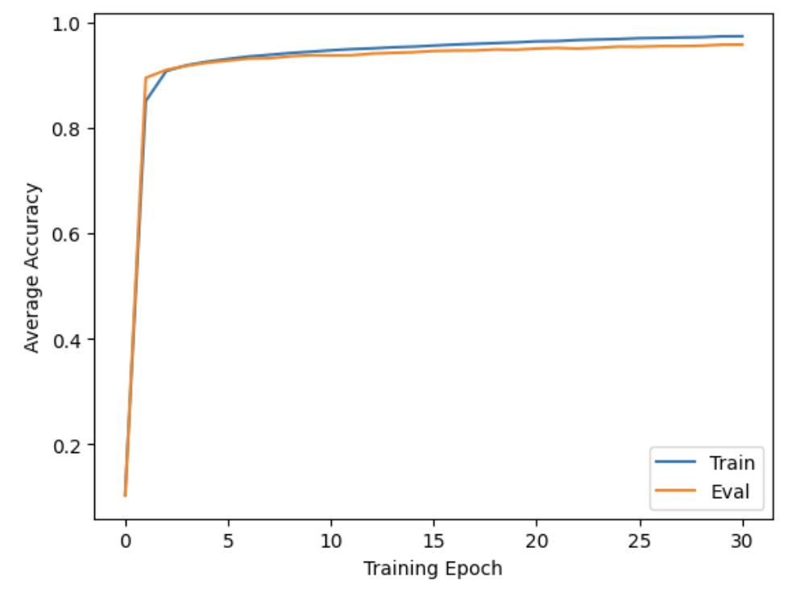{#fig-acc}

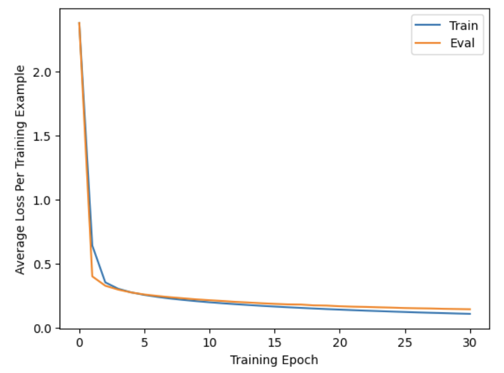{#fig-loss}

As you can see, the training accuracy is slightly higher than the evaluation accuracy, which is to be expected since the model is never trained on evaluation data. However, the discrepancy is small.

The model's best competition score so far is 0.95857.

## Conclusion

At last, we have come to the end of the journey. This has definitely been the longest, most technically dense, and most difficult post to write so far. I didn't expect it to be such a beast, but it was worth it. After performing all the derivations for backprop by hand and writing an MNIST classifier from scratch, I have gained a much better understanding of neural network fundamentals. I hope that readers have learned a lot as well. Be sure to tune in next time!

The code is available on [Kaggle](https://www.kaggle.com/code/cyborgoctopus/digidestined).
